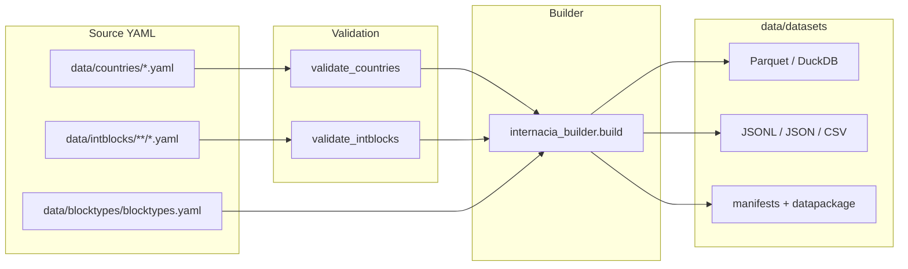

# Architecture

## Layers

1. **Source YAML** — curated records; edit these, never hand-edit `data/datasets/`.
2. **Validation** — JSON Schema + cross-dataset rules (`scripts/validate_*.py`).
3. **Build** — flattens, exports, embeds `_meta` build identity.
4. **Consumers** — DuckDB/Parquet preferred; CSV/lite for spreadsheets and LLM context.

## Enrichment

Optional Wikidata/World Bank enrichment lives in `scripts/enrich_*.py`. Scheduled
freshness checks: `.github/workflows/enrichment-check.yml` (may open a review PR).

## Related

- [getting-started.md](getting-started.md)
- [enrichment.md](enrichment.md)
- [strategy-and-user-needs.md](strategy-and-user-needs.md)
