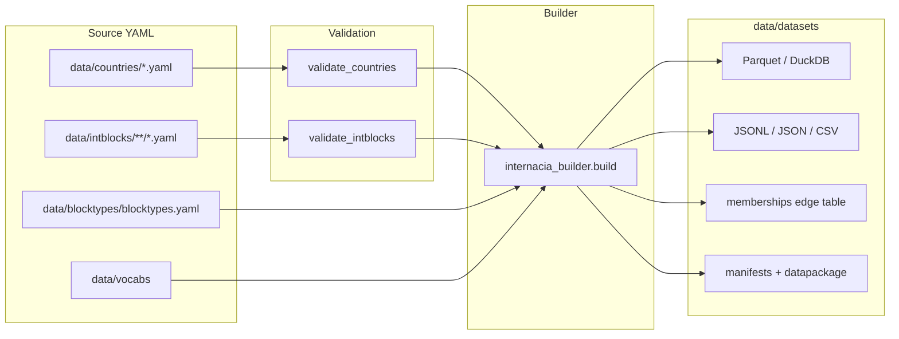

# Architecture

Internacia is a **data-as-code** pipeline: curated YAML is validated, then exported
to interchangeable artifacts. Do not hand-edit `data/datasets/`.

Current source scale (must match manifests): **256** countries, **1037** intblocks,
**78** blocktypes.

## Layers

1. **Source YAML** — one file per country or intblock. Edit these.
2. **Validation** — JSON Schema, completeness gates, cross-dataset rules
   (`scripts/validate_*.py` → `internacia_builder.validate`).
3. **Build** — `internacia_builder.build` flattens, writes exports, embeds `_meta`.
4. **Consumers** — DuckDB/Parquet preferred; CSV/lite for spreadsheets and LLM context;
   Python SDK or self-hosted internacia-api for apps.

## Export field coverage

Nested membership is available on every consumer path:

| Path | Departure dates (`left`) |
|------|--------------------------|
| Source YAML / JSONL / JSON | `includes[].left` |
| Parquet / DuckDB `intblocks.includes` | `left` is part of the struct |
| `memberships` table / `memberships.parquet` / `memberships.csv.zst` | column `left` |

Prefer `memberships` for roster analytics (no `UNNEST`). Lite Parquet/CSV omit nested
rosters — join back to full tables on `code` / `id`.

Schema field add/remove is recorded in `migration.vX.Y.Z.json` when `schema_hash`
changes. See [versioning-policy.md](versioning-policy.md).

## Enrichment

Optional Wikidata/World Bank enrichment lives in `scripts/enrich_*.py`. Scheduled
freshness checks: `.github/workflows/enrichment-check.yml` (may open a review PR).
Country provenance and intblock `last_verified` share a **12-month** advisory SLA
([enrichment.md](enrichment.md)).

## Governance

- OpenSpec (`openspec/`) for schema and breaking export changes. After a change
  ships, archive it (`openspec archive <id> --yes`) so `openspec list` stays
  current. Completed-but-unarchived folders under `openspec/changes/` are process
  debt, not open product work.
- Quality analyzer (`builder.py analyze-quality`) uses the same rule modules as
  the CLI validators; CI fails on CRITICAL/IMPORTANT.
- [docs/improvement-plan.md](improvement-plan.md) and
  [docs/strategy-and-user-needs.md](strategy-and-user-needs.md) are **historical**
  planning snapshots — do not treat their gap lists as current.

## Related

- [getting-started.md](getting-started.md)
- [versioning-policy.md](versioning-policy.md)
- [enrichment.md](enrichment.md)
- [ai-consumers.md](ai-consumers.md)
- [intblock-inclusion-policy.md](intblock-inclusion-policy.md)
