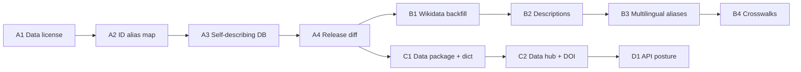

# Internacia-db Strategy & User-Needs Plan

> **Generated:** 2026-06-13
> **Repository:** internacia-db — reference datasets of countries, intergovernmental organizations, and country groups
> **Current release:** v1.3.0 (2026-06-12)
> **Consumers:** Dateno search engine, [internacia-api](../../internacia-api), [internacia-python](../../internacia-python)

This document is a **product / user-needs strategy**, complementary to the engineering-focused
[docs/improvement-plan.md](improvement-plan.md). The engineering plan (tests, validation parity,
pinned deps, release workflow, CONTRIBUTING) is largely **shipped in v1.3.0**; the remaining
internal-quality backlog lives in `openspec/changes/`. This plan instead asks: **who uses this data,
what do they actually need, and how should the project evolve to serve them.**

---

## 1. Goals & Strategy (restated)

**Mission.** Be the authoritative, machine-friendly reference dataset for countries,
intergovernmental organizations (intblocks), and country groupings — primarily as an
**enrichment source for the Dateno search engine**, and secondarily for any integrator who
needs clean, stable, multilingual geo/organizational reference data.

**Strategic principles.**
- **Data-as-code**: YAML source → validated → exported to JSONL/YAML/Parquet/DuckDB.
- **Trust through governance**: schema validation, completeness gates, provenance, manifests.
- **Consumer stability over feature velocity**: downstream pipelines must not break silently.

**The strategic shift this plan proposes:** the project has matured from "build a good dataset"
to "**operate a dependable data product**." The next wins are less about internal data quality
and more about the **contract with consumers** — stable identifiers, versioning, licensing,
crosswalks, and distribution.

---

## 2. Users & Their Needs

| Persona | Who | Primary need | Today's friction |
|---------|-----|--------------|------------------|
| **Enrichment pipeline** | Dateno search engine | High-recall entity linking (names, aliases, codes, multilingual) + stable joins | Templated descriptions, 40% intblocks missing `wikidata_id`, ID churn breaks joins |
| **SDK developer** | `internacia-python` users | Versioned, downloadable DB; predictable schema; offline use | DB version lives only in a sidecar JSON, not queryable in-DB; relative-path assumptions |
| **API consumer** | `internacia-api` users | Hosted, filterable, paginated HTTP access | No hosted instance, thin filtering, no pagination/auth/rate limits |
| **Open-data / researcher** | External integrators, analysts | Discoverable download, clear license, citation, data dictionary, crosswalks | MIT (code) license only; no DOI/data-hub presence; crosswalks limited to World Bank |
| **Contributor** | Maintainers + external | Author YAML, report data errors | Authoring covered by CONTRIBUTING; no "report a data error" path |

---

## 3. What the Product Does Well Today (feature review)

- **Multi-format export** (JSONL/YAML/Parquet/DuckDB, zstd-22) from a single `scripts/builder.py`.
- **Two governed datasets**: countries (252) and intblocks (1,057) now both have schema +
  completeness + manifest + CI validation (intblocks reached parity in v1.3.0).
- **Rich query surface via SDK**: lookup by code/iso3/numeric; filter by region, income,
  continent, currency, language, blocktype, member, acronym, tag, topic, founded year; and
  **multilingual fuzzy search** across names, codes, acronyms, translations.
- **Provenance & traceability**: field-level provenance on countries; `schema_hash` manifests;
  baseline diff in CI; CHANGELOG with migration notes.
- **Reproducible releases**: pinned deps, tagged releases with dataset assets, weekly link checks.

The data is solid. The gaps below are about **how consumers depend on it**.

---

## 4. User-Need Gaps (prioritized findings)

### 4.1 Data license is wrong for a data product — **Critical**
`LICENSE` is **MIT**, which governs *software*, not data. Adopters cannot tell whether they may
use/redistribute the datasets commercially, or how to attribute. Fields derive from
**World Bank (CC-BY-4.0)** and **Wikidata (CC0)**, which carry their own obligations.
→ This is the single biggest blocker to external adoption and to Dateno's own redistribution confidence.

### 4.2 Identifier stability has no contract — **Critical**
intblocks IDs are custom and have already churned (renames `ASF`→`FSA`, `CAF`→`CAFBANK`; 8 merges in
v1.3.0), described in the CHANGELOG as **breaking for consumers joining on ids**. There is no
machine-readable alias/redirect map, so any consumer keyed on these IDs breaks silently on upgrade.
→ Enrichment and SDK users need an **ID-stability policy + alias table**.

### 4.3 Version contract is not queryable in-DB — **High**
The SDK README explicitly wishes for a `metadata`/version table inside the DuckDB file; today
version/`schema_hash` live only in sidecar `*.manifest.json`. A consumer holding only
`internacia.duckdb` cannot reliably answer "what version/schema am I on?"
→ Embed a `_meta` table (and equivalent in Parquet sidecars) so the data is self-describing.

### 4.4 No machine-readable per-release diff — **High**
A baseline diff exists internally, but consumers get only prose CHANGELOG notes. For pipelines,
"what records were added/removed/renamed and which fields changed" should be a **release artifact**
(e.g. `diff-vX.Y.Z.json`).

### 4.5 Enrichment recall gaps (entity linking) — **High** (already partly in backlog)
For a search-enrichment consumer, recall is everything:
- **424 intblocks lack `wikidata_id`** → weaker entity linking (tracked: `add-intblocks-gap-backlog`).
- **~406 templated descriptions** ("International entity focused on…") add noise, not signal.
- **Multilingual alias coverage is uneven** — more `other_names`/translations/acronyms directly
  improve fuzzy-search recall, which is the SDK's headline feature.

### 4.6 Limited identifier crosswalks — **Medium**
Enrichment users routinely need to join against other systems. Today countries carry ISO codes,
M49, World Bank, Wikidata. High-value additions: **GeoNames id, UN/LOCODE country prefix, FIPS 10-4,
ITU/calling already present, IOC, FIFA**, and for orgs, Wikidata/ROR-style ids. A small set of
crosswalk columns turns this into a reference *hub*.

### 4.7 Distribution & discoverability — **Medium**
Distribution is git + GitHub Releases only. For the open-data audience, add presence on a
**data hub** (Hugging Face Datasets and/or Zenodo for a citable **DOI**), a
**Frictionless `datapackage.json`** descriptor, and a published **data dictionary** page
(generated from the JSON Schemas) so integrators can evaluate before downloading.

### 4.8 API productization — **Medium**
`internacia-api` is a thin SDK wrapper with **no hosted instance, pagination, filtering combinators,
caching, auth, or rate limiting**. If HTTP is meant to be a real consumption path (not just local),
it needs a hosted deployment + the basics above. Otherwise, position it explicitly as
"self-host only" to set expectations.

### 4.9 Light geospatial primitives — **Medium**
Capitals have coords and borders exist, but there are **no country centroids or bounding boxes**.
Many enrichment/geocoding consumers want at least centroid + bbox (full GeoJSON geometry remains
deliberately out of scope to avoid bloat).

### 4.10 Feedback / correction loop — **Low–Medium**
No issue templates or "report a data error" path for external users. A lightweight structured
correction workflow builds trust and crowdsources quality.

---

## 5. Recommendations & Roadmap

Grouped by theme; each maps to the gaps above. Items marked *(openspec)* should become OpenSpec
change proposals before implementation.

### Track A — Consumer contract (do first; highest leverage, lowest effort)
- **A1. Re-license data** *(Critical, openspec)*: adopt a data license (recommend **CC-BY-4.0**, or
  **CC0** for the original compilation) alongside MIT for the code; add an `ATTRIBUTION.md` / `DATA_LICENSE`
  documenting World Bank (CC-BY) and Wikidata (CC0) obligations and how to cite. Add SPDX/`dublin-core`-style
  fields to manifests.
- **A2. ID-stability policy + alias map** *(Critical, openspec)*: publish a policy (when IDs may change),
  and ship `data/datasets/intblocks_aliases.{json,parquet}` mapping retired/renamed ids → current id,
  generated from CHANGELOG history; validate it in CI.
- **A3. Self-describing datasets** *(High)*: embed a `_meta` table (version, build_date, git_commit,
  schema_hash, row_count) into `internacia.duckdb`; emit the same as `*.meta.json` next to Parquet.
- **A4. Machine-readable release diff** *(High)*: emit `diff-vX.Y.Z.json` (added/removed/renamed/changed)
  as a release asset; reuse `diff_countries_baseline.py` logic generalized to both datasets.

### Track B — Enrichment value (serves Dateno directly)
- **B1. Wikidata backfill for intblocks** *(High)* — already scoped in `add-intblocks-gap-backlog`.
- **B2. Description quality campaign** *(High)*: replace ~406 templated descriptions with sourced text
  (provenance required); track via a completeness metric.
- **B3. Multilingual alias expansion** *(Medium)*: measure per-record alias/translation coverage; set a
  warn-gate and backfill from Wikidata labels to raise fuzzy-search recall.
- **B4. Identifier crosswalks** *(Medium, openspec)*: add a vetted set of country crosswalk columns
  (GeoNames, UN/LOCODE prefix, FIPS, IOC, FIFA) with provenance; document in the schema.

### Track C — Distribution & adoption (open-data growth)
- **C1. `datapackage.json` (Frictionless)** *(Medium)* + generated **data dictionary** page from JSON Schemas.
- **C2. Publish to a data hub** *(Medium)*: Hugging Face Datasets and/or Zenodo DOI for citation.
- **C3. README/marketing**: "How consumers depend on this" section — versioning, license, stability promise.

### Track D — Access surface (only if HTTP is a real path)
- **D1. Decide API posture** *(Medium)*: host a public read-only instance **or** label it self-host-only.
- **D2. If hosted**: add pagination, filter combinators, caching, basic rate limiting; publish OpenAPI examples.

### Track E — Optional / deferred (guard against scope creep)
- **E1. Country centroids + bounding boxes** *(Medium)* — bounded geospatial, not full geometry.
- **E2. Correction workflow** *(Low–Medium)*: issue templates + structured data-error reports.
- **E3. Time-series indicators / historical snapshots** — explicitly **deferred** (bloat risk).

---

## 6. Suggested Sequencing

**Phase 1 (days):** A1 license, A3 `_meta` table, C3 README framing — cheap, unblock adoption.
**Phase 2 (1–2 wks):** A2 alias map, A4 release diff, C1 datapackage + data dictionary.
**Phase 3 (2–4 wks):** B1/B2/B3 enrichment recall, B4 crosswalks.
**Phase 4 (optional):** C2 data hub/DOI, D1/D2 API productization, E1 centroids.

---

## 7. Success Metrics

| Metric | Baseline (2026-06-13) | Target |
|--------|----------------------|--------|
| Explicit data license + attribution doc | None (MIT code only) | Published, SPDX in manifest |
| Retired/renamed IDs covered by alias map | 0% | 100%, validated in CI |
| Datasets self-describe version in-file | No (sidecar JSON only) | Yes (`_meta` in DuckDB + Parquet sidecar) |
| Machine-readable per-release diff | No | Shipped as release asset every tag |
| intblocks with `wikidata_id` | ~60% | ≥ 90% |
| intblocks with non-templated description | ~62% | ≥ 85% |
| Country identifier crosswalks | ISO/M49/WB/Wikidata | + ≥ 3 vetted systems |
| Discoverability (data hub / DOI) | git + releases | Listed on ≥1 hub, citable DOI |

---

## 8. Open Questions for Maintainers

- Preferred data license: **CC-BY-4.0** (attribution) vs **CC0** (max reuse) for the compilation?
- Is the REST API intended as a **public hosted service** or a self-host reference only?
- Which identifier crosswalks matter most to Dateno's enrichment (prioritizes B4)?
- Acceptable repo-size budget for distribution (affects keeping binaries in-git vs releases-only)?

---

## Review Log

| Date | Notes |
|------|-------|
| 2026-06-13 | Initial product/user-needs strategy. Complements `improvement-plan.md` (engineering, mostly shipped in v1.3.0). Key findings: data-license mismatch, ID-stability contract, self-describing versioning, enrichment recall. |

*Next review: after Phase 2, or 2026-09-13, whichever comes first.*
